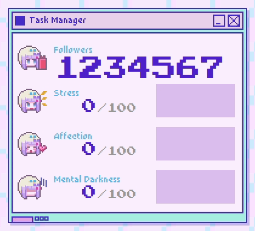

# Needy Streamer Overload Task Manager Recreation

A recreation of the task manager from the game Needy Streamer Overload, written in Python, uses Tkinter.

Requires the fonts [DinkieBitmap Demo](https://atelier-anchor.com/downloads/DinkieBitmap_Demo_v1_100.zip) and [Press Start 2P](https://github.com/codeman38/PressStart2P/releases/download/2.14/PressStart2P-2.14.zip).

